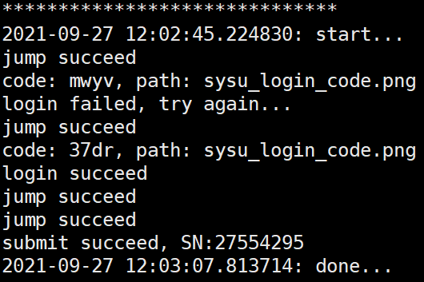

# SYSU自动健康申报-使用教程

> + 测试环境：Ubuntu 18.04
> + python版本：python 3.6.9
> + 特别提醒：由于涉及到netid等敏感信息，工具只能在自己的环境中使用，切勿假手于人。
> + 免责声明：本工具仅供学习和交流，禁止用于任何商业用途和任何诸如ddos攻击等违法行为。本工具今后造成的纠纷和一切后果，均由工具使用者承担，与本作者无关。

## 特性

+ 定时自动申报。
+ 采用非阻塞申报方式，最大申报时间为60s，超时后自动重新申报。
+ 申报过程出现`exception`并不会导致程序崩溃，而是重新申报。
+ 重新申报最大次数为3次。

## 换源

首先将下载源更换成[阿里源](https://developer.aliyun.com/mirror/ubuntu)。

```shell
sudo gedit /etc/apt/sources.list
```

将里面的内容替换成Ubuntu 18.04的阿里镜像源。

```
deb http://mirrors.aliyun.com/ubuntu/ bionic main restricted universe multiverse
deb-src http://mirrors.aliyun.com/ubuntu/ bionic main restricted universe multiverse

deb http://mirrors.aliyun.com/ubuntu/ bionic-security main restricted universe multiverse
deb-src http://mirrors.aliyun.com/ubuntu/ bionic-security main restricted universe multiverse

deb http://mirrors.aliyun.com/ubuntu/ bionic-updates main restricted universe multiverse
deb-src http://mirrors.aliyun.com/ubuntu/ bionic-updates main restricted universe multiverse

deb http://mirrors.aliyun.com/ubuntu/ bionic-proposed main restricted universe multiverse
deb-src http://mirrors.aliyun.com/ubuntu/ bionic-proposed main restricted universe multiverse

deb http://mirrors.aliyun.com/ubuntu/ bionic-backports main restricted universe multiverse
deb-src http://mirrors.aliyun.com/ubuntu/ bionic-backports main restricted universe multiverse
```

更新下载源。

```shell
sudo apt update
```

## 配置环境

下载`pip3`。

```shell
sudo apt install python3-pip -y
```

更新`pip3`，否则后面安装`opencv`时会卡住。

```shell
pip3 install --upgrade pip -i https://mirrors.aliyun.com/pypi/simple/
```

安装`opencv`。

```shell
sudo apt install cmake -y
sudo apt install libopencv-dev -y
pip3 install scikit-build -i https://mirrors.aliyun.com/pypi/simple/
pip3 install opencv-python -i https://mirrors.aliyun.com/pypi/simple/
```

安装`muggle_ocr`，`muggle_ocr`用作验证码识别。

```shell
pip3 install muggle_ocr -i https://mirrors.aliyun.com/pypi/simple/
```

安装`selenium`，`selenium`用来访问健康申报的网站。

```shell
pip3 install selenium -i https://mirrors.aliyun.com/pypi/simple/
```

安装`firefox`。

```shell
sudo apt install firefox
```

下载源码。

```shell
sudo apt install git -y
git clone https://github.com/NelsonCheung688585/SYSU_jksb.git jksb
```

进入`jksb`文件夹。

```shell
cd jksb
```

下载`firefox`驱动，`selenium`将使用其来访问网站。

```shell
wget https://github.com/mozilla/geckodriver/releases/download/v0.30.0/geckodriver-v0.30.0-linux64.tar.gz
tar -xvf geckodriver-v0.30.0-linux64.tar.gz
```

## 使用

在源码文件夹下，首先将`geckodriver`加入到环境变量。

```shell
export PATH=.:$PATH
```

这一步是必须的，否则会报如下错误。

```
Message: 'geckodriver' executable needs to be in PATH. 
```

启动，在命令行参数下加入`netid`，`passwd`，`hour`，`minute`，示例如下。

```shell
python3 sysu.py --netid=NelsonCheung --passwd=ilovesysu --hour=07 --minute=00
```

+ `--netid`表示netid。
+ `--passwd`表示密码。
+ `--hour`和`--minute`表示每天提交申报的时间，上面的例子是`07:00`提交申报。

将`NelsonCheung`和`ilovesysu`换成你的账号密码即可。

注意，密码中若含有特殊字符需要加上`\`。例如，

```
--passwd=ilovesysu!!!
```

应该输入

```
--passwd=ilovesysu\!\!\!
```

后面就可以看到如下信息。



其中，`SN`是申报成功的流水号。

为了实现定时申报，需要将该工具放到一台不会关机的电脑上，例如云服务器。然后在后台启动并持续运行，启动命令示例如下。

```shell
nohup python3 -u sysu.py --netid=NelsonCheung --passwd=ilovesysu --hour=07 --minute=00 > log.out &
```

每次只需查看`log.out`即可看到程序输出。

```shell
tail -f log.out
```

可以退出后重新登录，通过如下命令检查工具是否存在。

```shell
ps aux | grep sysu.py
```

可以启动多个工具，每个工具设置不同的时间。

如果不加时间，工具的默认时间是`08:00`。

在[reference_guide.md](reference_guide.md)中可以找到工具的实现方法。

## 一些问题
使用`kill`命令kill掉进程后会导致后台的`firefox`进程无法退出，从而导致资源泄露。此时需要手动`kill`掉未正常退出的`firefox`进程。