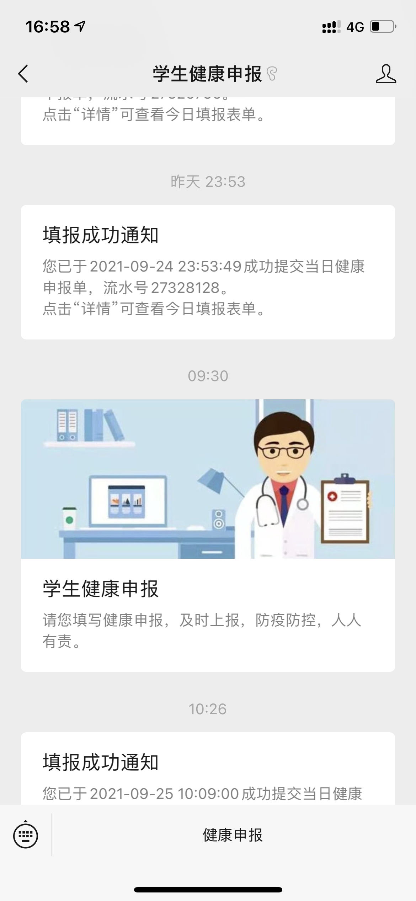
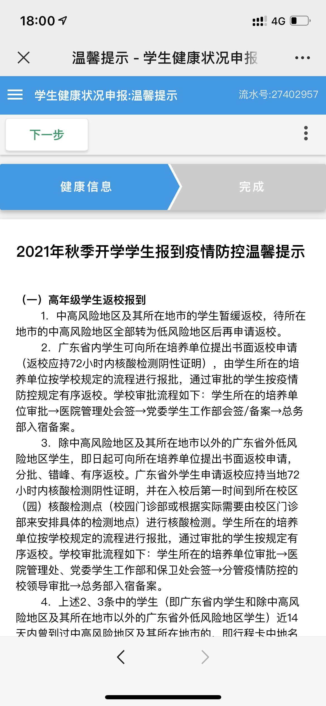
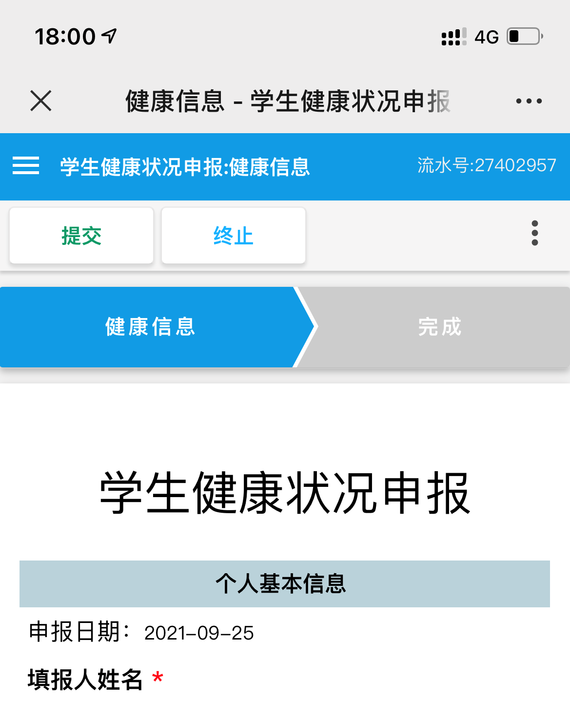
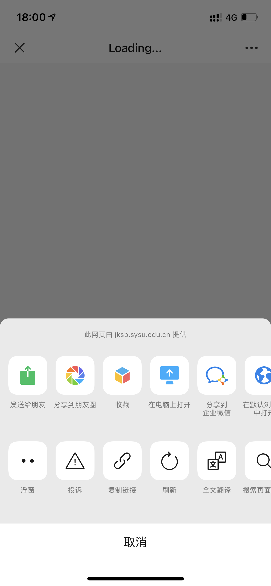
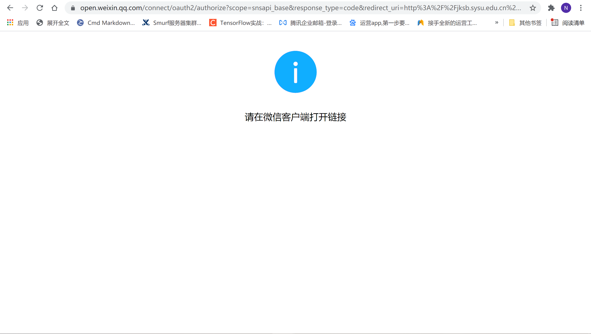
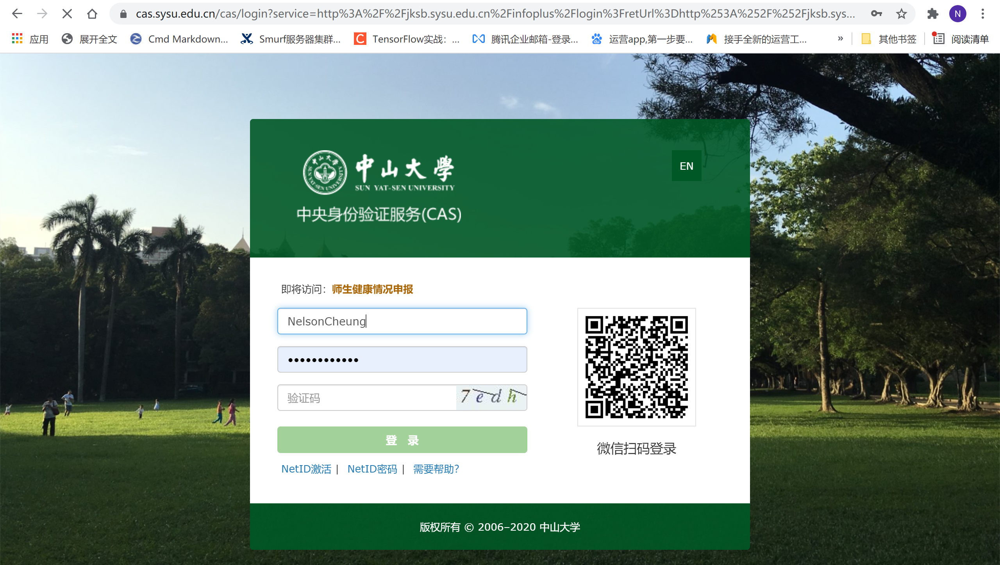
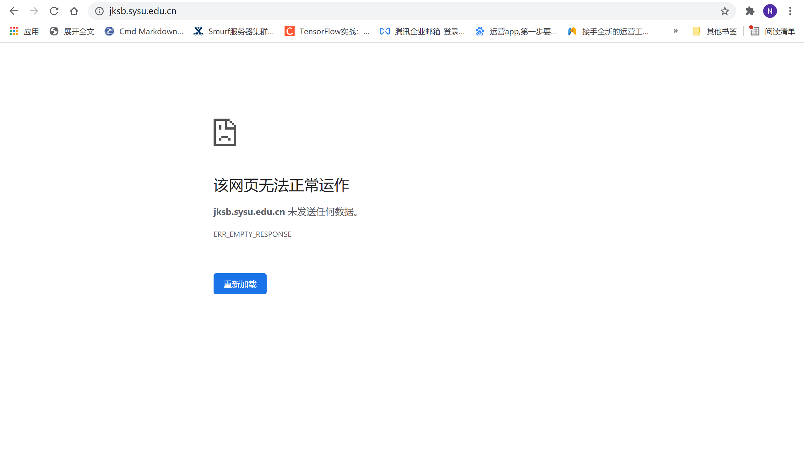
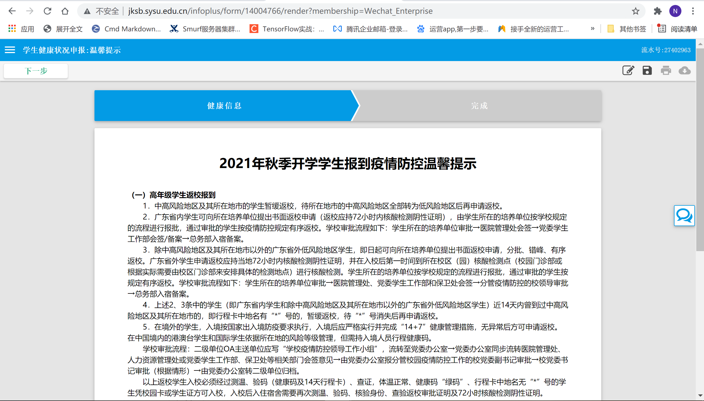
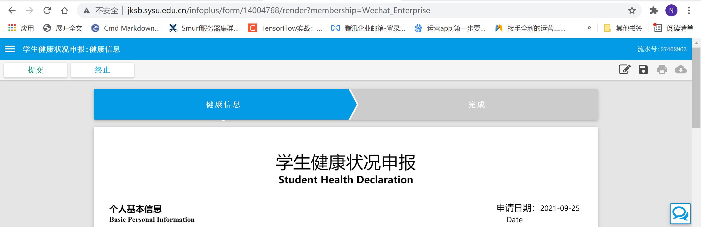

# Guidance

> + 本文主要介绍自动健康申报工具的实现思路。
> + 本工具的实现仅需要大二下的计网知识和Google，不需要懂HTML、CSS和JS等内容。 

# 想法来源

在微信上进行健康申报的时候，中大的学生健康申报每天都会发一则通知。



点开之后就可以看到温馨提示。



点击`下一步`后，来到填表申报页面。点击`提交`即可完成申报。



这就是健康申报的流程。不难想到，只要有一个工具自动帮助我们登录、打开健康申报页面、依次点击`下一步`和`提交`后，就能够实现自动申报。因此，首要的任务是找到健康申报页面的地址。

回到最开始的温馨提示页面，点击最下面的`<`，就可以找到进入温馨提示页面之前的地址。



点击右上角的`...`，然后点击`复制链接`将地址复制出来，得到如下地址。

```
http://jksb.sysu.edu.cn/infoplus/form/XNYQSB/start?membership=Wechat_Enterprise
```

观察上述地址不难发现，`jksb`就是"健康申报"的拼音缩写，微信上健康申报的页面是请求这个地址后返回的。此时，在Chrome下访问这个地址。访问后发现浏览器跳转到了一个新地址。



观察跳转后的地址发现，地址中出现了`auth`等字样，应该是没有经过认证。也就是说，在填写健康申报之前需要登录到健康申报系统。为什么在微信中可以直接填写呢？因为在微信中我们已经登录了，系统自然知道是谁在填写申报表。此时，我们可以做出一个猜想：”请在微信客户端打开“纯属唬人之鬼话，在`jskb.sysu.edu.cn`中必然存在某个地址是用于登录的，登录完成后再次访问上述地址即可跳转到健康申报页面。

为了找到这个登录页面，只能通过依次访问如下地址来碰碰运气。

```
http://jksb.sysu.edu.cn/infoplus/form/XNYQSB/start?membership=Wechat_Enterprise
http://jksb.sysu.edu.cn/infoplus/form/XNYQSB/
http://jksb.sysu.edu.cn/infoplus/form/
http://jksb.sysu.edu.cn/infoplus/
http://jksb.sysu.edu.cn/
```

碰巧的是，在访问下面这个地址时，浏览器跳转到了登录页面。

```
http://jksb.sysu.edu.cn/infoplus/
```



输入netid和密码登录后，直接跳转到了`jksb.sysu.edu.cn`



此时，再次访问申报表填写地址，可以发现浏览器自动跳转到了一份健康申报表。

```
http://jksb.sysu.edu.cn/infoplus/form/XNYQSB/start?membership=Wechat_Enterprise
```

依次点击`下一步`，`提交`后，可以发现手机微信可以接收到申报成功的通知。此时，将上述过程转换为代码后即可实现自动健康申报。





# 代码实现

在代码实现之前，首先梳理一下代码逻辑。

+ 访问如下地址

  ```
  http://jksb.sysu.edu.cn/infoplus/
  ```

  使用netid和密码登录。

+ 访问如下地址

  ```
  http://jksb.sysu.edu.cn/infoplus/form/XNYQSB/start?membership=Wechat_Enterprise
  ```

  得到健康申报表。

+ 依次点击`下一步`和`提交`即可完成申报。

首先获得`Firefox`的浏览器对象。

```python
	options = webdriver.FirefoxOptions()
	options.add_argument('--headless')
	driver = webdriver.Firefox(options=options)
```

`--headless`表示不打开浏览器界面。如果不加`--headless`则会在访问时自动打开浏览器界面。

访问健康申报登录地址。

```python
    while True:
        driver.get("http://jksb.sysu.edu.cn/infoplus/")

        while True:
            time.sleep(1)
            driver.switch_to.window(driver.window_handles[0])

            try:
                driver.find_element_by_name("submit")
            except selenium.common.exceptions.NoSuchElementException:
                pass
            else:
                print("jump succeed")
                break

        cookies = driver.get_cookies()[0]
        res = requests.get("https://cas.sysu.edu.cn/cas/captcha.jsp",
                           cookies={cookies['name']: cookies['value']})

        code_path = "sysu_login_code.png"
        with open(code_path, "wb") as f:
            f.write(res.content)
        code_text = sdk.predict(image_bytes=res.content)
        print("code: %s, path: %s" % (code_text, code_path))

        name = driver.find_element_by_id("username")
        name.send_keys(netid)
        name = driver.find_element_by_id("password")
        name.send_keys(passwd)
        name = driver.find_element_by_id("captcha")
        name.send_keys(code_text)
        name = driver.find_element_by_name("submit")

        try:
            name.click()
        except selenium.common.exceptions.WebDriverException:
            print("login succeed")
            break

        try:
            driver.find_element_by_name("submit")
        except selenium.common.exceptions.NoSuchElementException:
            print("login succeed")
            break
        else:
            print("login failed, try again...")
```

第1-46行，由于验证码识别使用了开源的OCR库muggleocr，可能会有识别误差。所以整个登录代码处在一个死循环中，只有当登录成功后才跳出循环，否则一直尝试登录。

第2-14行，访问登录网址，等待跳转。

第16-18行，利用cookie来得到验证码。

第20-24行，利用OCR库来识别验证码。

第26-32行，输入netid、密码和验证码。

第34-38行，登录系统。

第40-46行，通过检查页面中是否存在登录按钮来判断是否登录成功。

上述过程的背景知识可以通过阅读参考资料来学习。

登录到系统后，访问健康申报页面，并等待跳转。

```python
    driver.get("http://jksb.sysu.edu.cn/infoplus/form/XNYQSB/start?membership=Wechat_Enterprise")
    while True:
        time.sleep(1)
        driver.switch_to.window(driver.window_handles[0])

        try:
            driver.find_element_by_xpath("//a[contains(@id, 'infoplus_action')]")
        except selenium.common.exceptions.NoSuchElementException:
            pass
        else:
            print("jump succeed")
            break
```

跳转后依次点击`下一步`和`提交`即可完成申报。

```python
    name = driver.find_element_by_xpath("//a[contains(@id, 'infoplus_action')]")
    time.sleep(1)
    name.click()

    while True:
        time.sleep(1)
        driver.switch_to.window(driver.window_handles[0])

        try:
            driver.find_element_by_xpath("//a[contains(@id, 'infoplus_action')]")
        except selenium.common.exceptions.NoSuchElementException:
            pass
        else:
            print("submit succeed")
            break

    name = driver.find_element_by_xpath("//a[contains(@id, 'infoplus_action')]")
    time.sleep(1)
    name.click()

    time.sleep(2)
    driver.quit()
```

详细代码在`utils.py`中。

为了实现定时申报，可以加入时间检查，到指定的时间后即可触发自动健康申报。

```python
flag = True
day = -1

while True:
    time.sleep(1)
    now = datetime.datetime.now()

    if now.day != day:
        flag = True
        day = now.day

    if flag and (now.hour > hour or (now.hour == hour and now.minute >= minute)):
        flag = False
        do_jksb(netid, passwd)
```

netid、密码和申报时间可以通过命令行来输入。

```python
def print_help_msg():
    print("python3 sysu.py --netid=your_netid --passwd=your_password [--hour=your_hour] [--minute=your_minute]\n" \
          "e.g. python3 sysu.py --netid=NelsonCheung --passwd=ilovesysu --hour=6 --minute=30" \
          )

try:
    opts, args = getopt.getopt(sys.argv[1:], shortopts="", longopts=["help", "netid=", "passwd=", "hour=", "minute="])
except getopt.GetoptError:
    print_help_msg()
    sys.exit(-1)

hour = 6
minute = 30
netid = None
passwd = None

for opt, arg in opts:
    if opt == "--help":
        print_help_msg()
        sys.exit(0)
    elif opt == "--netid":
        netid = arg
    elif opt == "--passwd":
        passwd = arg
    elif opt == "--hour":
        try:
            hour = int(arg)
        except ValueError:
            print("wrong type for hour")
            # print_help_msg()
            sys.exit(-1)

        if hour < 0 or hour > 24:
            print("wrong type for hour")
            # print_help_msg()
            sys.exit(-1)
    elif opt == "--minute":
        try:
            minute = int(arg)
        except ValueError:
            print("wrong type for minute")
            # print_help_msg()
            sys.exit(-1)

        if minute < 0 or minute > 60:
            print("wrong type for hour")
            # print_help_msg()
            sys.exit(-1)

if netid is None or passwd is None:
    print("netid and passwd must be provided")
    print_help_msg()
    sys.exit(-1)
```

以上就是工具的实现细节。

# 参考资料

+ 中山大学健康申报自动化脚本 https://github.com/tomatoF/jksb_sysu
+ python + web操作爬虫自动填写表单 https://blog.csdn.net/CLOUD_J/article/details/99968588
+ 利用selenium实现验证码获取并验证 https://zhuanlan.zhihu.com/p/25171554
+ muggleocr通用识别 https://www.pythonf.cn/read/151412